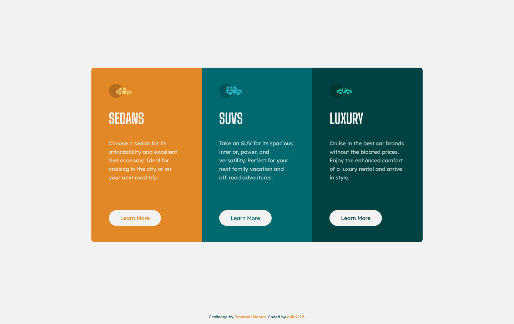

# Frontend Mentor - 3-column preview card component solution

This is a solution to the [3-column preview card component challenge on Frontend Mentor](https://www.frontendmentor.io/challenges/3column-preview-card-component-pH92eAR2-). Frontend Mentor challenges help you improve your coding skills by building realistic projects.

## Table of contents

- [Overview](#overview)
  - [The challenge](#the-challenge)
  - [Screenshot](#screenshot)
  - [Links](#links)
- [My process](#my-process)
  - [Built with](#built-with)
  - [Continued development](#continued-development)
  - [Useful resources](#useful-resources)
- [Author](#author)
- [Acknowledgments](#acknowledgments)

## Overview

### The challenge

Users should be able to:

- View the optimal layout depending on their device's screen size
- See hover states for interactive elements

### Screenshot

### Links

- Solution URL: [GitHub](https://github.com/ania221B/3-column-preview-card-component)
- Live Site URL: [GitHub Pages](https://ania221b.github.io/3-column-preview-card-component/)

## My process

### Built with

- Semantic HTML5 markup
- CSS custom properties
- Flexbox
- CSS Grid
- Mobile-first workflow
- CUBE CSS

### Continued development

- Grid
- CUBE CSS

### Useful resources

- [Set the position on all four sides with one CSS property!](https://www.youtube.com/watch?v=sdvfwwFBmMk) - I learnt about inset from this video.
- [How to use mix-blend-mode, and how to avoid problems with it](https://www.youtube.com/watch?v=TAA89nkEuhw) - I learnt about isolation from this video but it also contains useful tips on how to make text look good when there's background.

## Author

- Frontend Mentor - [@ania221B](https://www.frontendmentor.io/profile/ania221B)

## Acknowledgments

[@ApplePieGiraffe](https://www.frontendmentor.io/profile/ApplePieGiraffe) offered helpful advice and resources for previous challenges and these came in handy for this one too. Thank you!
